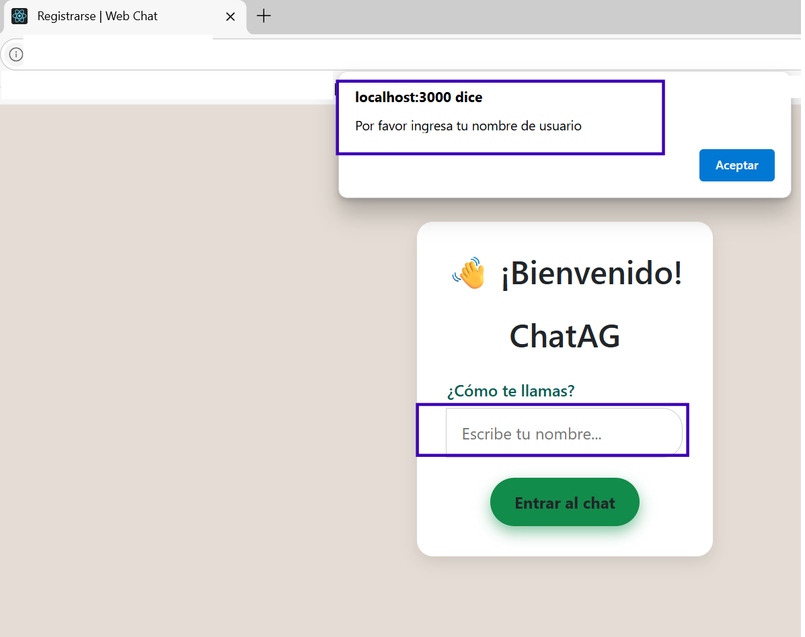
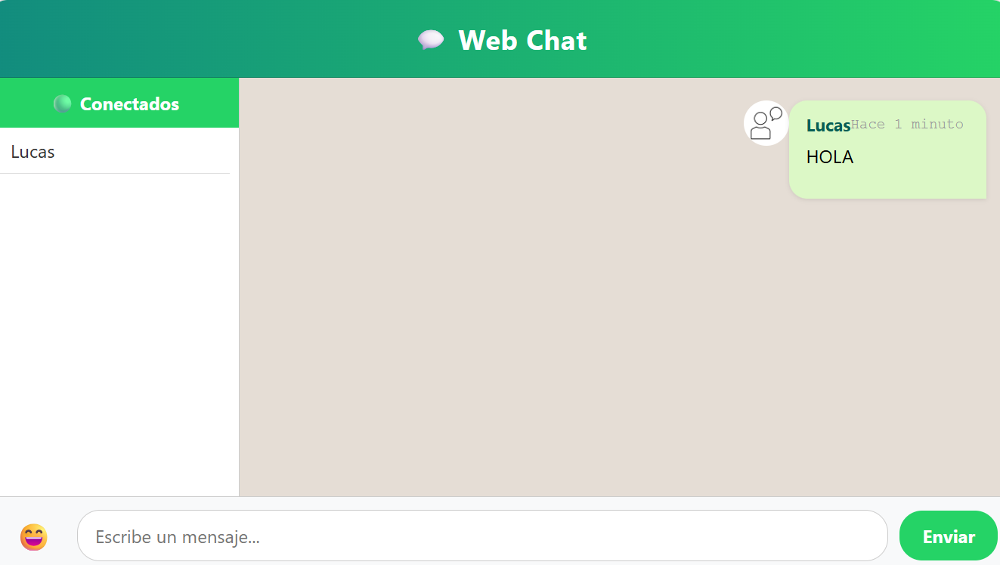
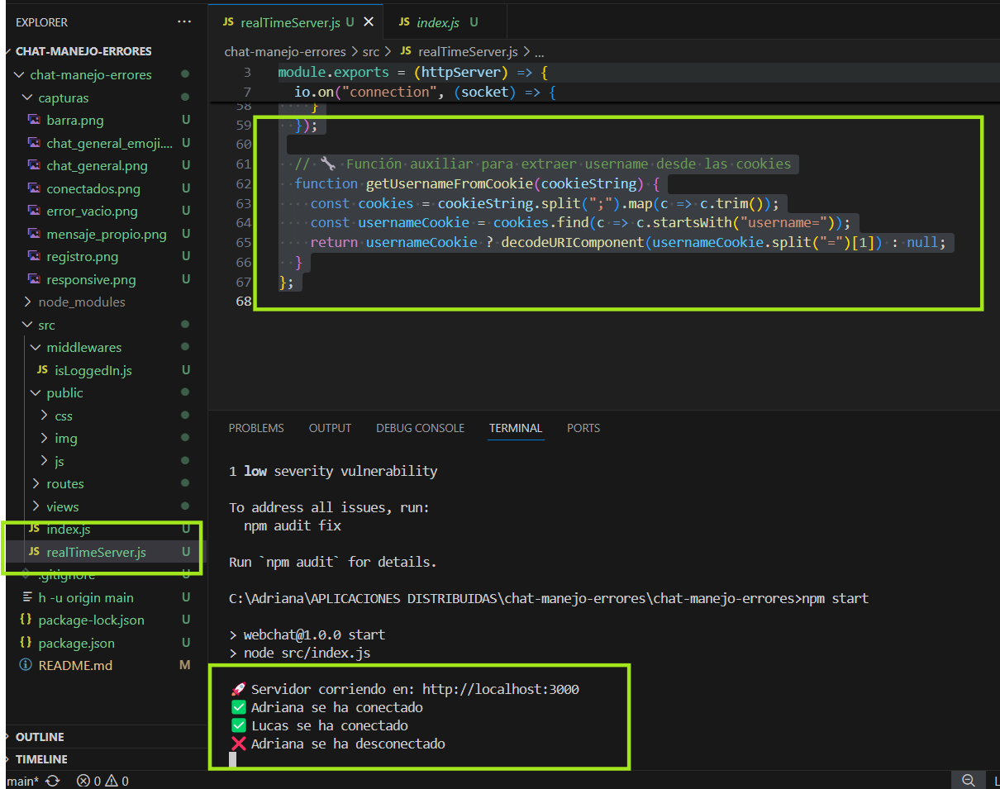

# ⚠️ Tarea 2: Manejo de Excepciones en una Aplicación Node.js (WebChat con Socket.IO)

---

## 🧾 Portada

- **Título del informe:** Manejo de excepciones en una aplicación Node.js  
- **Nombre completo del estudiante:** Adriana Pamela González Orellana  
- **Carrera / Curso:** 7mo Curso - 23128 Aplicaciones Distribuidas  
- **Fecha de entrega:** 27 de junio de 2025

---

## 🧠 Objetivo General

Realizar un informe técnico detallado sobre las estrategias de manejo de excepciones en Node.js, aplicadas a un proyecto real de la Unidad 1: *WebChat en tiempo real con Socket.IO*.

---

## 💡 Introducción

El manejo de excepciones es un componente esencial en cualquier aplicación backend. Permite detectar, controlar y responder de forma segura a errores imprevistos, mejorando así la estabilidad, seguridad y experiencia de usuario.

En este informe se documenta cómo se integró el manejo de errores en el proyecto **WebChat**, desarrollado previamente en la Unidad 1, utilizando `Node.js`, `Socket.IO` y `Express`.

---

## 🛠️ Tecnologías utilizadas

- Node.js  
- Express.js  
- Socket.IO  
- HTML5, CSS3  
- JavaScript  
- Bootstrap 5  

---

## 🚨 Tipos de errores en Node.js

| Tipo de Error     | Descripción                                      |
|-------------------|--------------------------------------------------|
| `SyntaxError`     | Código mal escrito, error de sintaxis.          |
| `ReferenceError`  | Variable o constante no definida.               |
| `TypeError`       | Operación no válida sobre un tipo incorrecto.   |
| `SystemError`     | Errores del sistema, como problemas de red.     |
| `CustomError`     | Errores definidos por el desarrollador.         |

---

## ✅ Buenas prácticas aplicadas

- Uso de `try...catch` para capturar excepciones en tiempo real.
- Validación de entradas desde el cliente.
- Respuesta clara y directa al cliente usando `socket.emit("error", ...)`.
- Logging de errores en consola para facilitar el debugging.
- Desconexión de usuarios anónimos como medida de seguridad.

---

## 🧪 Ejemplo aplicado a WebChat

### Código implementado para validar el envío de mensajes:

```js
socket.on("message", (message) => {
  try {
    if (!message || typeof message !== "string" || !message.trim()) {
      throw new Error("El mensaje no puede estar vacío.");
    }

    io.emit("message", {
      user: username,
      message: message.trim(),
    });
  } catch (error) {
    console.error(`❌ Error en mensaje de ${username}:`, error.message);
    socket.emit("error", `Error en el mensaje: ${error.message}`);
  }
});
```

Este bloque de código impide que se envíen mensajes vacíos y notifica al cliente mediante una alerta personalizada.

---

## ♻️ Refactorización aplicada

- El archivo `realTimeServer.js` se actualizó para validar conexiones, manejar errores y responder directamente al cliente.
- Se implementó `socket.on("error", ...)` en el cliente para mostrar mensajes de error en pantalla.
- Se garantiza que el sistema no se caiga ante entradas inválidas.

---

## 📸 Evidencia de funcionamiento

### ❌ Error al enviar mensaje vacío
Cuando se intenta enviar un mensaje vacío, se activa la validación y se muestra un mensaje de error al usuario:



---

### 👤 Usuario conectado
Cuando un usuario inicia sesión, se actualiza la lista de usuarios conectados y se muestra su estado en tiempo real:



---

### 🔌 Usuario desconectado
Al cerrar la pestaña o salir del chat, se actualiza automáticamente la lista de usuarios conectados y se notifica al resto:



---

## 📁 Estructura del proyecto

```
chat-manejo-errores/
│
├── src/
│   ├── public/
│   │   ├── css/
│   │   ├── js/
│   │   └── img/
│   ├── routes/
│   ├── views/
│   ├── realTimeServer.js
│   └── index.js
│
├── capturas/
│   ├── error_vacio.png
│   ├── usuario_conectado.png
│   └── usuario_desconectado.png
│
├── README.md
└── package.json
```

---

## 🔄 Cómo ejecutar el proyecto

1. Clona el repositorio:

```bash
git clone https://github.com/Apgonzlez1/chat-manejo-errores.git
cd chat-manejo-errores
```

2. Instala las dependencias:

```bash
npm install
```

3. Inicia la aplicación:

```bash
npm start
```

4. Abre en el navegador:  
`http://localhost:3000/register`

---

## 📝 Conclusiones

- El manejo de errores en tiempo real es fundamental en aplicaciones con múltiples usuarios simultáneos.
- Validar las entradas y responder de forma controlada mejora la experiencia del usuario y previene caídas.
- Refactorizar el código para centralizar la lógica mejora la mantenibilidad del proyecto.
- Este ejercicio demostró que incluso pequeños cambios de control elevan mucho la robustez del sistema.

---

## 📚 Referencias

- [Node.js - Error Handling](https://nodejs.org/api/errors.html)  
- [Socket.IO Documentation](https://socket.io/docs/v4/error-handling/)  
- [MDN Web Docs - try...catch](https://developer.mozilla.org/es/docs/Web/JavaScript/Reference/Statements/try...catch)  

---

## 📊 Evaluación según Rúbrica

A continuación, se presenta cómo este informe cumple con cada uno de los criterios de evaluación establecidos:

### 🧪 Investigación y Tipos de Errores

Se incluye una explicación detallada y clara sobre los tipos de errores más comunes en Node.js: `SyntaxError`, `TypeError`, `ReferenceError`, `SystemError` y `CustomError`. Cada uno está definido y contextualizado dentro de su uso en desarrollo backend.

✅ **Cumple completamente** con este criterio.

---

### ⚙️ Aplicación Práctica

Se implementó validación de mensajes vacíos usando bloques `try...catch`, se agregó notificación de errores al cliente, y se documentó con ejemplos reales del proyecto WebChat. Los errores son capturados en tiempo real y el usuario es notificado.

✅ **Cumple completamente** con este criterio.

---

### 📏 Uso de Buenas Prácticas

El proyecto aplica buenas prácticas como:

- Uso de `try-catch` para validación de entradas.
- Logging con `console.error()`.
- Validación antes de emitir eventos.
- Respuesta controlada al cliente.

✅ **Cumple completamente** con este criterio.

---

### 📘 Documentación y Claridad del Informe

El archivo `README.md` presenta:

- Objetivo e introducción.
- Tipos de errores.
- Código implementado.
- Capturas de pantalla.
- Explicación de cada evidencia.
- Instrucciones de ejecución.
- Conclusiones y referencias.


